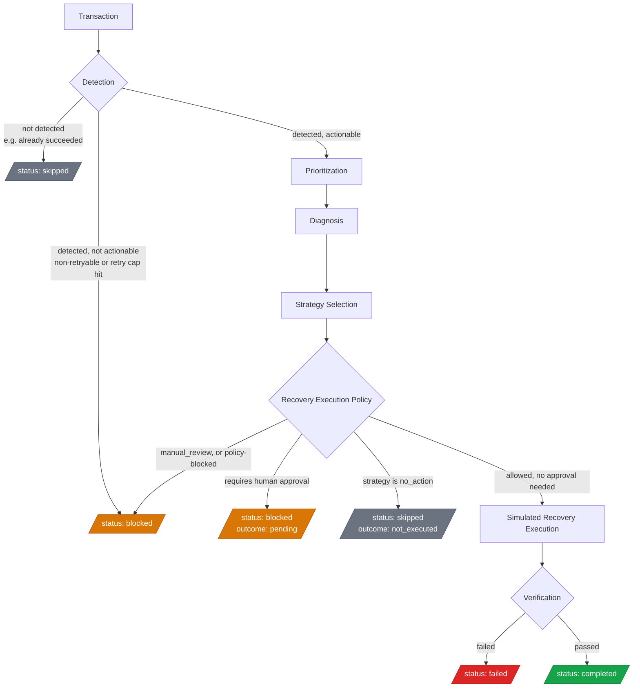

# RecoverAI

[](https://github.com/koustavx08/recoverai/actions/workflows/ci.yml)

**AI-powered revenue recovery infrastructure for merchants.**

> **Status: a complete, closed-loop, six-stage recovery pipeline — for one
> transaction or a batch of thousands — with every recovery outcome and
> every portfolio metric explicitly SIMULATED. No real payment action, no
> real Razorpay call, no real money movement, anywhere in this repo.** The
> CLI genuinely ingests transaction data (JSON or CSV), classifies why
> payments failed, and scores revenue risk/recoverability with fixed,
> documented rules. A deterministic Detection stage decides what's worth
> pursuing; a deterministic Prioritization stage explains how urgently; a
> real Diagnosis Agent and a real Strategy Agent (both LLM-assisted via
> Anthropic when `AI_API_KEY`/`AI_MODEL` are set, with a deterministic
> fallback otherwise) produce structured, evidence-grounded, policy-bounded
> output; a real, fully deterministic Recovery Agent turns a bounded
> strategy into a policy-checked, seeded **simulation** — never a live
> execution — and an independent Verification Agent re-checks the result
> before anything is recorded. `RecoveryPipeline` now orchestrates all six
> stages end to end — for one transaction (`recoverai pipeline run
> --transaction <id>`) or a full batch (`recoverai pipeline run --file
> <file>`), aggregating portfolio-level metrics. See
> [§8](#8-agent-architecture). Every simulated recovery is explicitly
> labeled `SIMULATED`/`simulationMode: true`; nothing in this repo claims
> real recovered revenue. See
> [Current project status](#current-project-status) before assuming any
> feature works end to end.

## 1. What RecoverAI is

RecoverAI is a platform that helps merchants recover revenue lost to failed
or abandoned payments. When a charge fails — a card is declined, a UPI
request times out, a customer abandons checkout — that revenue isn't
necessarily gone. Some of it is recoverable: a retry, a payment link, a
different payment method, a well-timed follow-up.

RecoverAI's job is to:

1. **Detect** transactions that represent revenue at risk.
2. **Diagnose** why the payment failed.
3. **Prioritize** which failures are worth acting on and how urgently.
4. **Select a strategy** most likely to recover the transaction.
5. **Execute** a bounded recovery action.
6. **Verify** whether the action actually recovered the revenue.
7. **Record everything** in an immutable audit trail.

## 2. The problem it solves

Payment failures are routine at any scale, but most merchants have no
systematic way to triage them: which failures are worth pursuing, what the
right recovery action is, and whether attempted recoveries actually worked.
A failed payment isn't automatically lost revenue — a meaningful share of
declines, timeouts, and abandoned checkouts are recoverable — but without
a system to tell those apart from the ones that aren't, merchants either
do nothing (leaving recoverable revenue on the table) or retry
indiscriminately.

**Blind retrying is actively harmful, not just wasteful.** Re-attempting
every failed charge the same way, regardless of why it failed, burns
gateway calls on failures that were never retryable (an expired card
doesn't fix itself), can trip a bank's or processor's own fraud/velocity
controls (repeated attempts on a declined card are themselves a fraud
signal), and annoys customers who already said no. This is exactly why
RecoverAI's Detection stage enforces a hard retry cap and the Recovery
Execution Policy independently re-checks it (see [§8](#8-agent-architecture)
and [`docs/security-model.md`](./docs/security-model.md)) — the system is
built to *stop* trying as much as it is built to try.

RecoverAI is designed to be the system that sits between "a payment
failed" and "someone (or something) should try to recover it" — deciding
whether it's worth pursuing, diagnosing why it failed, choosing a bounded
recovery action, and verifying the result — with every decision
explainable and every action audited.

## 3. High-level architecture

```
                         ┌─────────────────────┐
                         │   apps/web (Next.js) │  merchant dashboard
                         └──────────┬───────────┘                (dashboard reads live analysis)
                                    │
                         ┌──────────┴───────────┐
                         │   packages/cli        │  developer-facing CLI
                         └──────────┬───────────┘
                                    │  command → service → core
              ┌─────────────────────┼─────────────────────┬─────────────────────┐
              │                     │                     │                     │
   ┌──────────┴─────────┐ ┌─────────┴─────────┐ ┌─────────┴─────────┐ ┌─────────┴─────────┐
   │  packages/agents     │ │ packages/analysis   │ │ packages/database  │ │ packages/integrations│
   │  detection→priorit.→  │ │ ingest → normalize →│ │ repository ports    │ │ PaymentProvider,     │
   │  diagnosis→strategy→  │ │ classify → score →   │ │ + in-memory/SQLite  │ │ RecoveryActionProvider│
   │  recovery→verification│ │ prioritize (real,     │ │                     │ │ + simulator/Razorpay  │
   │  (all six implemented,│ │ deterministic, no AI)  │ │                     │ │  stub, no live path)  │
   │  SIMULATION-only exec) │ │                        │ │                     │ │                       │
   └──────────┬─────────┘ └─────────┬─────────┘ └─────────┬─────────┘ └─────────┬─────────┘
              │                     │                     │                     │
              └─────────────────────┴─────────────────────┴─────────────────────┘
                                    │
                         ┌──────────┴───────────┐
                         │   packages/core        │  framework-independent
                         │   domain models & ports │  domain layer
                         └────────────────────────┘

                         packages/config — typed, Zod-validated env config
                         used by every layer above.
```

**The core invariant:** `packages/core` has no dependency on Next.js,
React, Commander, a database client, or any vendor SDK. Every other package
depends inward on `core`; `core` depends on nothing in this repo.
`packages/analysis` depends only on `core` and `database` — agents will
depend on `analysis`'s output later, not the other way around.

## 4. Repository structure

```text
recoverai/
├── apps/
│   └── web/                # Next.js merchant dashboard — every route reads real data
│       ├── app/             # dashboard, transactions, recovery, demo, audit-log
│       ├── components/      # layout shell (incl. mobile nav) + UI primitives
│       └── lib/              # server-only data loaders, one per route
│
├── packages/
│   ├── core/                # domain models, enums, repository/system ports
│   ├── config/               # typed env config, validated with Zod
│   ├── cli/                  # `recoverai` CLI (Commander + Zod)
│   │   └── src/{commands,services,utils}
│   ├── analysis/               # ingestion + deterministic risk-scoring pipeline
│   │   └── src/{ingestion,classification,risk}
│   ├── agents/                # Detection→...→Verification agent contracts
│   │   └── src/{agents,orchestration,tools}
│   ├── integrations/           # PaymentProvider / RecoveryActionProvider
│   │   └── src/{interfaces,simulator,razorpay}
│   └── database/                # repository implementations (in-memory + SQLite/Prisma)
│
├── data/
│   ├── samples/                  # hand-authored deterministic fixtures (JSON + CSV)
│   ├── demo/                      # 5-case curated demo dataset (scenarios.json)
│   ├── evaluation/                 # ground-truth cases for the 4 evaluate:* harnesses
│   └── generated/                   # output of scripts/generate-sample-data.ts (gitignored)
│
├── docs/                            # risk-scoring.md, agent-architecture.md,
│                                       security-model.md, e2e-testing.md
├── scripts/                        # generate-sample-data.ts, evaluate-*.ts
├── tests/                           # cross-package/integration/E2E-CLI tests
├── .github/workflows/               # ci.yml — typecheck/lint/test/build on every push
├── .env.example
└── pnpm-workspace.yaml
```

`packages/cli`, `packages/analysis`, `packages/agents`, and `apps/web` all
depend on `core` for types — none of them define their own copies of
`Transaction`, `RevenueRisk`, etc.

## 5. Technology stack

| Area         | Choice                                                                       |
| ------------ | ---------------------------------------------------------------------------- |
| Language     | TypeScript, strict mode, everywhere                                          |
| Package mgmt | pnpm workspaces                                                              |
| Web          | Next.js 15 (App Router), Tailwind CSS, shadcn-style primitives, lucide-react |
| CLI          | Commander.js, Zod, `tsx` for dev                                             |
| Validation   | Zod (CLI options, environment config)                                        |
| Testing      | Vitest                                                                       |
| Lint/format  | ESLint (flat config) + `eslint-config-next` for the web app, Prettier        |

## 6. CLI vision

```text
recoverai init       # scaffold local project configuration          [not implemented]
recoverai ingest     # load transaction data (JSON/CSV) into the store [implemented]
recoverai analyze    # run the deterministic risk-analysis pipeline    [implemented]
recoverai simulate   # exercise the pipeline via the payment simulator [not implemented]
recoverai recover    # run a SIMULATED recovery execution               [implemented — simulation only]
recoverai report     # generate a merchant-facing recovery report      [not implemented]
recoverai agent      # run/inspect a single agent pipeline stage       [diagnosis, strategy implemented]
recoverai pipeline   # run the full 6-stage pipeline (single or batch)  [implemented — simulation only]
```

Every command follows the same layering: **CLI command → service → core
domain**. Command handlers in `packages/cli/src/commands` only parse and
validate input (via Zod) and print results — they never contain business
logic. That logic belongs in a service (`packages/cli/src/services`),
which calls into `packages/analysis` (for `ingest`/`analyze`), and into
`packages/agents`/`packages/integrations` for `agent` and `recover`.

```bash
recoverai ingest --file data/samples/transactions.json
recoverai ingest --file data/samples/transactions.csv
recoverai analyze                                  # defaults to the bundled sample dataset
recoverai analyze --file data/generated/transactions.json --json

recoverai agent --stage diagnosis --transaction txn_00002
recoverai agent --stage strategy  --transaction txn_00002 --json

recoverai recover --transaction txn_00002           # SIMULATED recovery execution — never live
recoverai recover --transaction txn_00002 --seed abc --json
recoverai recover --transaction txn_00002 --live    # rejected — no live execution path exists

recoverai pipeline run --transaction txn_00002       # full 6-stage pipeline for one transaction
recoverai pipeline run --file data/samples/transactions.json   # batch mode — every transaction in the file
recoverai pipeline run --file data/generated/transactions.json --seed abc --json

recoverai pipeline run --file data/demo/scenarios.json         # 5 curated demo cases, narrated below
recoverai pipeline run --transaction demo_txn_04 --file data/demo/scenarios.json  # one case, full walkthrough
```

`ingest`, `analyze`, `agent`, `recover`, and `pipeline` all read and write
through the same durable, SQLite-backed store (`packages/database`'s
`createPrismaDatabase()`) — data ingested in one invocation is visible to
the next. `init`, `simulate`, `report`, and every
`agent` stage other than `diagnosis`/`strategy` still validate their
arguments for real but return "Not implemented yet." for the actual
operation. `recover` and `pipeline` always run in simulation mode;
`recover --live` is rejected outright rather than silently ignored —
there is no hidden live-execution path anywhere in this codebase.
`pipeline run` runs in **batch mode over every transaction in the file**
whenever `--transaction` is omitted — this is the one command that
processes a whole file's worth of transactions in one invocation.

**Demo scenarios.** `data/demo/scenarios.json` is a small, hand-picked
dataset (6 transactions, 5 named cases) chosen to walk through the full
range of real pipeline outcomes — not just the happy path:

| Case | What it shows |
| --- | --- |
| `demo_txn_01` — Successful Recovery | Issuer decline + prior success with a different payment method → `switch_payment_method` → SIMULATED success → verified |
| `demo_txn_02` — No Action Needed | Already succeeded → Detection stops the pipeline immediately, nothing downstream runs |
| `demo_txn_03` — Retry Limit Blocked | Three failed attempts already on record → Detection blocks it outright before any diagnosis is attempted |
| `demo_txn_04` — Manual Review Required | An ambiguous processor error → Diagnosis/Strategy escalate to `manual_review` → the Recovery Execution Policy blocks it — a human has to look at this one |
| `demo_txn_05` — Pending Human Approval | Insufficient funds on a high-value transaction → `manual_followup` is selected but requires approval → execution stays `pending`, nothing simulated yet |

Every outcome above is produced by the real `RecoveryPipeline` — nothing
is hand-written or scripted — and is also rendered as narrated cards on
the `/demo` dashboard page (see [Current project status](#11-current-project-status)),
each one showing the real diagnosis explanation and strategy rationale
behind the decision, not just the outcome label. `/demo` opens with a
four-tile **Act / Wait / Block / Escalate** legend, each tile linking to
the scenario that demonstrates it, so a first-time viewer can see
RecoverAI's actual decision framework before reading a single card. The
point of this dataset isn't "AI recovers everything" — it's that
RecoverAI **knows when to act, and knows when not to**.

## 7. Transaction intelligence (deterministic, not AI)

`@recoverai/analysis` implements the pipeline described in
[`docs/risk-scoring.md`](./docs/risk-scoring.md):

```text
Ingestion → Normalization → Validation → Failure Classification
   → Risk / Recoverability Scoring → Prioritization → Recovery Candidates
```

Every number is computed by a fixed, documented rule or formula — there is
no model call anywhere in this package, and `confidence` on a
classification means "how directly the evidence maps to this category,"
never a model's self-reported confidence. `riskScore` (how much revenue
is at stake) and `recoverabilityScore` (how likely it can be recovered)
are deliberately separate metrics — see the doc for the exact weights.
`expectedRecoveryAmount` is a projection (`amount × recoverabilityScore`),
labeled as an estimate everywhere it's shown; nothing in this repo claims
revenue has actually been recovered.

## 8. Agent architecture

```text
Transaction
    │
    ▼
Detection        — is this transaction revenue at risk, and worth pursuing now? [implemented — DeterministicDetectionAgent]
    │
    ▼
Prioritization    — how much is at stake, how urgently, and why?               [implemented — DeterministicPrioritizationAgent]
    │
    ▼
Diagnosis         — why did it fail, and is it recoverable?                     [implemented — GroundedDiagnosisAgent]
    │
    ▼
Strategy Selection — what should we try?                                          [implemented — GroundedStrategyAgent]
    │
    ▼
Recovery Execution — do it, in SIMULATION only                                     [implemented — SimulatedRecoveryAgent]
    │
    ▼
Verification       — did the simulated attempt look internally valid?               [implemented — DeterministicVerificationAgent]
```

The diagram above shows the six stages in sequence; it doesn't show what
actually determines a transaction's fate — the branch points. This does,
and matches `RecoveryPipeline.run()`'s real control flow exactly (see
`packages/agents/src/orchestration/recovery-pipeline.ts`):



Every terminal box above is a real `PipelineStatus` value
(`completed | blocked | skipped | failed`) — the pipeline never throws
for any of these; each becomes a structured `PipelineResult` instead
(see `docs/e2e-testing.md` for tests exercising every branch shown here).

**All six stages are now real, implemented agents** — no stub, no
`AgentNotImplementedError` anywhere in this pipeline. Each stage is defined
as a TypeScript interface in `packages/agents/src/agents` (`DetectionAgent`,
`PrioritizationAgent`, `DiagnosisAgent`, `StrategyAgent`, `RecoveryAgent`,
`VerificationAgent`). `packages/agents/src/orchestration`'s `RecoveryPipeline`
now genuinely wires all six together — `pipeline.run(facts)` threads each
stage's typed output into the next stage's typed input, tracks which
stages actually ran, and returns a structured `PipelineResult` with a
bounded `status` (`completed` | `blocked` | `skipped` | `failed`). It never
throws for an expected business outcome (non-retryable, a retry limit,
`manual_review`, a failed verification) — every one of those becomes a
`PipelineResult` with an explanatory `status`/`statusReason` instead, and
an unexpected internal error is caught and reported the same way rather
than propagating (so one bad transaction never aborts a batch of others).
`BatchRecoveryPipeline` runs the pipeline sequentially over any number of
transactions and aggregates `PortfolioMetrics` (priority/diagnosis/
strategy/execution distributions, revenue at risk, **simulated** recovered
amount, simulation recovery rate, verification pass rate) — see
`recoverai pipeline run` and the `/recovery` dashboard route below.

Detection and Prioritization run *before* Diagnosis in the real pipeline
(cheaply filtering out what doesn't need the more expensive AI-capable
stages) rather than after, as the original six-stage naming might suggest
— Detection needs the deterministic failure classification that already
has to run for every failed/abandoned transaction anyway, and
Prioritization packages the risk score that Diagnosis/Strategy already
depend on. Detection blocks non-retryable failures and exhausted retry
limits *before* they'd otherwise reach Diagnosis's own (separately
testable) handling of the same conditions — both layers agree, by design,
not by accident.

### Recovery Execution: simulation only, by construction

```text
BOUNDED STRATEGY  (a validated StrategyDecision — never re-derived here)
  │
  ▼
EXECUTION POLICY  (packages/agents/src/recovery/policy.ts — canExecute())
  │            narrows to: allowed (with a bounded action + approval flag) or blocked, with a reason
  ▼
SIMULATED RECOVERY ACTION  (packages/integrations' RecoveryExecutionSimulator —
  │                          pure, seeded computation; never contacts Razorpay,
  │                          a bank, a UPI provider, or a customer)
  ▼
SIMULATED OUTCOME  (RecoveryExecutionResult — outcome ∈ {success, failure,
  │                  pending, blocked, not_executed}; simulationMode: true, always)
  ▼
VERIFICATION  (packages/agents/src/recovery/deterministic-verification.ts —
  │             independently re-checks internal consistency, e.g. "success
  │             implies recoveredAmount > 0," never trusting the execution's
  │             own report)
  ▼
AUDIT TRAIL  (AuditEvent: recovery_action_executed, recovery_verified)
```

`RecoveryExecutionPolicy.canExecute()` is the single gate: `manual_review`
is always blocked (it defers to a human, it isn't an action); a
non-retryable diagnosis or a retry limit blocks any retry-based action; a
strategy that `requiresHumanApproval` (e.g. `manual_followup`,
`send_payment_link`, `offer_installments`) is allowed to plan but resolves
as `pending` rather than being simulated to success/failure, since no
automated approval mechanism exists yet. Only once policy has allowed an
action *and* it needs no approval does `RecoveryExecutionSimulator` run —
a deterministic, seeded draw (`seededFloat`, shared with the existing
`PaymentSimulator`/`RecoveryActionSimulator`) against a probability
computed by `simulation-profile.ts` from diagnosis category, strategy,
recoverability score, prior attempts, alternate-payment-method history,
and transaction value — always logged as an explainable `factors` list,
and always labeled a "simulation estimate," never a real-world prediction.
The same transaction + strategy + seed always reproduces the same result.

### Detection and Prioritization: deterministic, no model, no re-derivation

- **`DeterministicDetectionAgent`** (`packages/agents/src/detection/`) —
  a cheap, fully deterministic gate: succeeded/pending transactions are
  `detected: false`; refunded, non-retryable, or retry-limit-exhausted
  ones are `detected: true, actionable: false` (recorded, not pursued);
  everything else is `actionable: true` and proceeds. Severity is graded
  from transaction value alone (`critical`/`high`/`medium`/`low`/`none`).
- **`DeterministicPrioritizationAgent`** (`packages/agents/src/
  prioritization/`) — never recomputes `riskScore`/`recoverabilityScore`/
  `priority` (that's `@recoverai/analysis`'s `scoreTransaction()`'s job,
  reused as-is); it only packages the already-computed priority tier into
  a bounded, explainable `PrioritizationResult` with a deterministic
  `factors` list (transaction value, recoverability, customer history,
  retry headroom) and a plain-language `explanation` — never an LLM.

### Diagnosis and Strategy: the pattern both agents follow

```text
FACTS  (deterministic — @recoverai/analysis classification + risk scoring)
  │
  ▼
DETERMINISTIC INTELLIGENCE  (packages/agents/src/diagnosis/facts.ts, strategy/policy.ts)
  │
  ▼
EVIDENCE  (fixed-id EvidenceItem[] bundle, generated only by deterministic code)
  │
  ▼
GENAI REASONING  (optional — AIModelProvider, only if AI_API_KEY/AI_MODEL are set)
  │
  ▼
STRUCTURED, VALIDATED OUTPUT  (Diagnosis / StrategyDecision — Zod-bounded)
  │
  ▼
BOUNDED RECOMMENDATION  (never an executed action)
```

Never `Raw transaction → LLM → "trust me"`. The deterministic layer always
runs first and establishes the facts, the evidence bundle, and (for
Strategy) the policy-approved candidate set; the model — when configured —
can only reason over what it's given, cite evidence by a fixed `id` it
cannot invent, and choose from a bounded enum it cannot expand. Every LLM
response is re-validated after the fact (evidence grounding, category/
strategy bounds, hard safety constraints like "never retry a non-retryable
failure") — a response that fails validation is discarded, not repaired,
and the agent falls back to a fully deterministic decision that never
pretends to be AI-generated (`metadata.mode` is always accurate). See
`packages/agents/src/diagnosis/` and `packages/agents/src/strategy/` for
the concrete implementations, and `data/evaluation/` +
`pnpm evaluate:diagnosis` / `pnpm evaluate:strategy` for their accuracy
against synthetic ground-truth cases.

**No stage in this pipeline executes anything real.** Detection and
Prioritization only classify and explain; `GroundedDiagnosisAgent.
diagnose()` and `GroundedStrategyAgent.selectStrategy()` only return
structured data; `SimulatedRecoveryAgent.executeRecovery()` only ever runs
a deterministic, seeded simulation (see above). No payment is charged, no
payment link is actually sent, no notification actually goes out, no real
retry is scheduled, anywhere in this repository. See `data/evaluation/`
+ `pnpm evaluate:diagnosis` / `evaluate:strategy` / `evaluate:recovery` /
`evaluate:pipeline` for each layer's accuracy against synthetic
ground-truth cases — the last of these runs the real, complete
`RecoveryPipeline` end to end against 50 cases and checks pipeline-level
status correctness, policy compliance, and same-seed simulation
consistency.

## 9. Local development setup

**Prerequisites:** Node.js ≥ 20, [pnpm](https://pnpm.io) (`npm install -g pnpm`
if you don't have it).

```bash
# install dependencies for every workspace package
pnpm install

# generate the Prisma client and apply migrations — creates
# packages/database/prisma/dev.db (SQLite, gitignored, no external
# database required)
pnpm db:generate
pnpm db:migrate

# build every package (required before running the CLI's built bin)
pnpm build

# type-check, lint, test
pnpm typecheck
pnpm lint
pnpm test

# true end-to-end coverage: builds, then spawns the real CLI binary
# (see docs/e2e-testing.md)
pnpm test:e2e

# accuracy against synthetic ground-truth cases, computed from real runs
pnpm evaluate:diagnosis
pnpm evaluate:strategy
pnpm evaluate:recovery
pnpm evaluate:pipeline

# run the web dashboard
pnpm dev:web        # http://localhost:3000

# run the CLI
pnpm recoverai --help
pnpm dev:cli -- analyze --json     # run the CLI from source via tsx, no build needed

# generate a larger, still-deterministic synthetic dataset (JSON + CSV)
pnpm generate:data -- --count 10000 --seed 42
pnpm recoverai analyze --file data/generated/transactions.json
```

## 10. Environment variables

See [`.env.example`](./.env.example) for the full, commented list. Copy it
to `.env` and fill in only what you need — **the simulator provider
requires no credentials at all**, which is the default.

| Variable                                  | Required when                                                                        |
| ----------------------------------------- | ------------------------------------------------------------------------------------ |
| `DATABASE_URL`                            | `NODE_ENV=production`; optional otherwise — defaults to a local SQLite file (`packages/database/prisma/dev.db`) if unset |
| `RAZORPAY_KEY_ID` / `RAZORPAY_KEY_SECRET` | `PAYMENT_PROVIDER=razorpay`                                                          |
| `AI_API_KEY` / `AI_MODEL`                 | `NODE_ENV=production`; optional otherwise — unset means the Diagnosis/Strategy agents run their deterministic fallback |
| `NEXT_PUBLIC_APP_URL`                     | always (defaults to `http://localhost:3000`)                                         |

Configuration is loaded and validated once, at process startup, via
`@recoverai/config`'s `loadConfig()` (Zod-backed). Missing required
production configuration throws a `ConfigValidationError` listing every
problem — it does not fail silently or fall back to defaults in production.

## 11. Current project status

**Implemented:**

- Monorepo structure, strict TypeScript config, ESLint, Prettier.
- `@recoverai/core`: domain models, enums, and repository/system ports.
- `@recoverai/config`: typed, Zod-validated environment configuration.
- `@recoverai/database`: repository interfaces + two implementations — an
  in-memory one (tests, isolated demo runs) and a durable SQLite-backed
  one via Prisma (`createPrismaDatabase()`, `packages/database/src/prisma/`),
  used by both the CLI and the dashboard for real, cross-process
  persistence.
- `@recoverai/analysis` **(new)**: a real, deterministic pipeline —
  ingest JSON or CSV, validate and normalize records, classify why a
  payment failed, score risk/recoverability, and rank recovery candidates.
  No model calls; see [`docs/risk-scoring.md`](./docs/risk-scoring.md) for
  the exact rules.
- `@recoverai/integrations`: `PaymentProvider` / `RecoveryActionProvider`
  abstractions, a deterministic simulator implementation (no credentials
  required), an unimplemented Razorpay stub, and **`AIModelProvider`** — a
  vendor-agnostic `generateStructured<T>()` contract with one real
  implementation, `AnthropicProvider` (forces tool-based structured output,
  validates it against the caller's own Zod schema before returning; no
  free-form prose parsing).
- `@recoverai/agents`: interfaces for all six pipeline stages, **all six
  now with real implementations**, plus `RecoveryPipeline` — a real
  orchestrator that wires them together end to end — and
  `BatchRecoveryPipeline`, which runs it sequentially over any number of
  transactions and aggregates portfolio metrics:
  - **`DeterministicDetectionAgent`** (`packages/agents/src/detection/`) —
    a cheap, deterministic gate deciding whether a transaction is a
    revenue-risk event worth pursuing now. No model.
  - **`DeterministicPrioritizationAgent`** (`packages/agents/src/
    prioritization/`) — explains and packages the already-computed
    deterministic risk/priority signal into a bounded, auditable result
    with a factor list. Never re-derives the underlying score. No model.
  - **`GroundedDiagnosisAgent`** (`packages/agents/src/diagnosis/`) —
    grounded, evidence-cited, LLM-assisted diagnosis with a deterministic
    fallback. See [§8](#8-agent-architecture).
  - **`GroundedStrategyAgent`** (`packages/agents/src/strategy/`) — takes a
    `Diagnosis` + deterministic risk context, narrows the strategy
    candidate set through an explicit `StrategyPolicy` *before* any model
    ever sees it, and returns a bounded `StrategyDecision` — never an
    executed action. `requiresHumanApproval` is always computed
    deterministically, never trusted from the model.
  - **`SimulatedRecoveryAgent`** (`packages/agents/src/recovery/`) — turns a
    validated `StrategyDecision` into a policy-checked, **SIMULATED**
    execution: `RecoveryExecutionPolicy.canExecute()` gates everything
    (non-retryable, retry limits, `manual_review` always blocked,
    approval-required strategies resolve as `pending`), a deterministic
    strategy→action mapping (`RecoveryStrategyType → RecoveryActionType`,
    both bounded, `@recoverai/core`) decides the concrete action, and only
    a policy-allowed, non-approval action ever reaches
    `RecoveryExecutionSimulator` (`@recoverai/integrations`) — pure, seeded
    computation that never contacts Razorpay, a bank, a UPI provider, or a
    customer. No LLM involved; fully deterministic.
  - **`DeterministicVerificationAgent`** (`packages/agents/src/recovery/`) —
    independently re-checks a `RecoveryExecutionResult` for internal
    consistency (e.g. "success ⟹ recoveredAmount > 0," "blocked ⟹ zero
    amount + a reason," "simulationMode must be true") — never trusting
    the recovery agent's own report, never using a model.
- `@recoverai/config`: adds `AI_PROVIDER`/`AI_API_KEY`/`AI_MODEL`;
  `config.ai.isConfigured` is true only once both a key and model are set,
  so agents can tell "no AI configured" apart from "AI configured but
  failed" without ever hardcoding credentials.
- `@recoverai/cli`: all eight commands registered. **`ingest`, `analyze`,
  `agent --stage diagnosis|strategy`, `recover`, and `pipeline run` are
  fully functional** (real ingestion, real classification, real risk
  scoring, real detection/prioritization/diagnosis/strategy selection,
  real policy-checked SIMULATED recovery execution + independent
  verification — see [§7](#7-transaction-intelligence-deterministic-not-ai)
  and [§8](#8-agent-architecture)). `pipeline run --transaction <id>` runs
  the full six-stage pipeline for one transaction; omitting `--transaction`
  runs it in **batch mode** over every transaction in the file (verified
  at 10,000 transactions in ~7 seconds, fully deterministic, every
  verification passing). `recover`/`pipeline` always run in simulation
  mode; `recover --live` is rejected outright, not silently ignored —
  there is no hidden live-execution path. `init`, `simulate`, `report`,
  and every other `agent` stage still return "Not implemented yet."
- `apps/web`: the `/dashboard` route renders real numbers (GMV, revenue at
  risk, estimated recoverable, failure breakdown, top opportunities)
  computed server-side via `@recoverai/analysis`, linking through to
  `/dashboard/diagnosis/[transactionId]` — a real, server-rendered
  diagnosis → strategy → execution → simulation → verification view for
  one transaction (evidence, confidence, policy-approved candidate
  strategies, the selected one and its approval requirement, the mapped
  action, the simulation probability estimate and its factors, the
  simulated outcome/recovered amount, verification status, and full audit
  metadata per stage), with an explicit "AI GENERATED" /
  "DETERMINISTIC FALLBACK" badge per AI-capable stage and a prominent
  "SIMULATION MODE" badge over the entire recovery-execution area. The
  `/recovery` route is now a real **portfolio dashboard**: it runs the
  full `RecoveryPipeline`/`BatchRecoveryPipeline` over the bundled sample
  dataset server-side and renders pipeline status counts, priority/
  diagnosis/strategy/execution distributions, revenue at risk, and
  **simulated** recovered amount/recovery rate — all computed live, no
  fabricated chart or number, and every recovery figure explicitly
  SIMULATED. `/demo` is a fifth route: five hand-picked, narrated cases
  (`data/demo/scenarios.json`) each rendered as a card walking through
  every stage the real pipeline ran for it — including the real
  `Diagnosis.explanation`/`StrategyDecision.rationale` sentences, not just
  the outcome label — chosen specifically to show a success, a skip, a
  Detection-level block, a policy-level block, and a pending-approval case
  side by side, all from real pipeline runs. A four-tile **Act / Wait /
  Block / Escalate** legend at the top links to the case that demonstrates
  each. `/transactions` and `/audit-log` are real too, not placeholders:
  `/transactions` lists the ingested sample dataset with status filter
  chips and drill-down links into `/dashboard/diagnosis/[id]` for every
  failed/abandoned transaction; `/audit-log` derives real `AuditEvent`
  rows (one per stage that ran, per transaction) from an actual
  `RecoveryPipeline` batch run — nothing on either route is fabricated for
  display. Every route also has a route-shaped loading skeleton
  (`loading.tsx`), and the app has a styled `error.tsx`/`not-found.tsx`
  and a mobile-responsive slide-in navigation drawer below the `md`
  breakpoint (no new dependency — a small React context).
- Deterministic sample data: `data/samples/transactions.json` (rich) and
  `data/samples/transactions.csv` (flat), covering successful payments,
  issuer declines, insufficient funds, UPI failures, network timeouts,
  expired cards, checkout abandonment, repeated failures, and refunds, plus
  `data/demo/scenarios.json` — a small curated set for demos and
  presentations (see [§6](#6-cli-vision)). The
  generator (`scripts/generate-sample-data.ts`) now produces realistic,
  weighted, repeat-customer distributions at any scale (verified
  deterministic at 10,000 records) and emits both JSON and CSV.
- Four evaluation harnesses against synthetic, ground-truth cases —
  `data/evaluation/diagnosis-cases.json` (22 cases) /
  `pnpm evaluate:diagnosis`, `data/evaluation/strategy-cases.json`
  (25 cases) / `pnpm evaluate:strategy`,
  `data/evaluation/recovery-cases.json` (30 cases) /
  `pnpm evaluate:recovery`, and `data/evaluation/pipeline-cases.json`
  (50 cases) / `pnpm evaluate:pipeline` — the last of these runs the real,
  complete `RecoveryPipeline` end to end (no hand-constructed intermediate
  stage output) and reports pipeline-status accuracy, policy violations,
  invalid outputs, verification failures, and same-seed simulation
  consistency. All four compute real results from an actual run against
  the real agents; none hardcode a result.
- 405+ Vitest tests across 53+ files: domain types, config validation, the
  payment simulator's determinism, ingestion (valid/malformed JSON+CSV),
  every failure classification category, risk/recoverability scoring
  bounds and behavior, prioritization ordering, dataset-generator
  determinism, CLI command/service wiring, the full diagnosis/strategy/
  recovery agent suites, detection (every detected/actionable rule),
  prioritization (every factor), the full `RecoveryPipeline`
  (successful/skipped/blocked/manual-review/verification-failure paths,
  stage-metadata preservation, never throwing), `BatchRecoveryPipeline`
  (mixed outcomes, deterministic aggregation, metrics consistency), the
  web dashboard's server-only data loaders (`apps/web/lib/*.test.ts` —
  demo scenario outcomes, transaction filtering, audit-trail shape,
  against a real pipeline run, not rendered markup), and a secret-redaction
  suite (`packages/agents/src/security/`) — no real API or network calls
  in any automated test.
- **A narratively organized end-to-end suite**
  (`packages/agents/src/orchestration/pipeline.e2e.test.ts`) running the
  real `RecoveryPipeline`/`BatchRecoveryPipeline` through the seven
  scenarios that define RecoverAI's core behavior (success, skip,
  Detection-level block, policy-level block, pending approval,
  retry-limit block, and verification catching a malformed result), plus
  **`tests/e2e-cli.test.ts`**, which spawns the actual built `recoverai`
  binary as a real child process (not the exported service function
  in-process) to verify the CLI itself — argv, stdout, exit code — behaves
  correctly, including that `recover --live` exits non-zero having done no
  work. See [`docs/e2e-testing.md`](./docs/e2e-testing.md); run
  deliberately with `pnpm test:e2e`.
- **A GitHub Actions CI workflow** (`.github/workflows/ci.yml`) running
  build → typecheck → lint → test on every push/PR to `main` — no secrets
  required, since every check runs against the deterministic fallback
  path.
- **A code-verified security and architecture review**
  ([`docs/security-model.md`](./docs/security-model.md)) — not just
  documentation of intent, but an adversarial pass over the actual
  implementation: AI-output validation, the single execution-policy gate,
  three independent retry-limit checks, simulation-mode guarantees,
  verification independence, and audit/secret handling. It found and
  fixed one real issue (AI provider error messages were stored verbatim
  in `fallbackReason`, reaching the audit trail and dashboard unredacted —
  now redacted for credential-shaped substrings) and confirmed everything
  else already correctly enforced, with reasoning for each recorded in
  the doc, not just asserted.

**Explicitly NOT implemented (by design, at this stage):**

- **No real payment recovery of any kind.** Every recovery execution in
  this repository is a **SIMULATION** — `RecoveryExecutionResult.
  simulationMode` is always `true`; there is no code path, in the CLI, the
  dashboard, or any agent, that can mark one `false`.
- **No live Razorpay execution.** `RazorpayPaymentProvider` and
  `RazorpayRecoveryActionProvider` throw until implemented; the recovery
  simulator never contacts Razorpay, a bank, a UPI provider, or a customer.
- **No real money movement, anywhere.** Nothing in the CLI, JSON output,
  or dashboard claims a "₹X recovered" outside of an explicit `SIMULATED`
  label. Every recoverable/recovered amount shown is either a deterministic
  *projection* (`expectedRecoveryAmount`, pre-execution) or a *simulated*
  outcome (`recoveredAmount`, post-execution) — never confirmed real
  revenue.
- **No production recovery workflows.** `recover --live` is rejected
  outright with a clear error rather than silently downgraded to
  simulation or left to fail unpredictably; there is no approval-granting
  mechanism yet, so every strategy that `requiresHumanApproval` resolves
  to `pending`, never to an auto-approved execution.
- **The dashboard doesn't record its own page views as audit/execution
  history.** Both the CLI (`ingest`, `analyze`, `agent`, `recover`,
  `pipeline run`) and the dashboard (`apps/web/lib/*`) now read and write
  through the same `createPrismaDatabase()` store
  (`packages/database/src/prisma/`), so ingested transactions are real,
  shared, and durable — `/transactions`, `/dashboard`, `/recovery`, the
  diagnosis drill-down, and `/audit-log` all show the accumulated store
  (the bundled sample dataset, seeded idempotently, plus anything
  separately ingested via `recoverai ingest`), not a fresh recompute of
  one static file. What the dashboard does *not* do is write its own
  live pipeline runs back into `RecoveryActionRepository`/
  `AuditEventRepository` — those stay real-time-computed-but-unrecorded on
  every view, deliberately, so that loading a page (a GET request) never
  creates a permanent audit-log/recovery-action entry. Only the CLI's
  explicit `recover`/`pipeline run`/`agent` commands write those.
- `init`, `simulate`, `report`, and every `agent` stage other than
  `diagnosis`/`strategy` are still stubs.
- **No authentication or multi-tenant isolation on the dashboard.** There
  is no login and no per-merchant access control — anyone who can reach
  `apps/web` can see every ingested transaction and diagnosis. Fine for a
  local demo, not for anything resembling production — see
  [`docs/security-model.md`](./docs/security-model.md#known-limitations).

## 12. Planned implementation phases

1. ~~**Ingestion & intelligence**~~ — ✅ done: real `ingest`/`analyze`,
   deterministic classification and risk scoring (`@recoverai/analysis`).
2. ~~**AI Diagnosis Agent**~~ — ✅ done: `GroundedDiagnosisAgent` — grounded,
   evidence-cited, LLM-assisted diagnosis (Anthropic) with a deterministic
   fallback, wired into the CLI and dashboard, with an evaluation harness.
3. ~~**Strategy Selection Agent**~~ — ✅ done: `GroundedStrategyAgent` —
   policy-bounded strategy selection over a validated `Diagnosis` +
   deterministic risk context, wired into the CLI and dashboard, with its
   own evaluation harness. Recommends only; executes nothing.
4. ~~**Recovery Execution Simulator**~~ — ✅ done: `SimulatedRecoveryAgent` +
   `RecoveryExecutionPolicy` + `RecoveryExecutionSimulator` +
   `DeterministicVerificationAgent` — a policy-gated, deterministically
   seeded **simulation** of recovery execution (never live), wired into the
   CLI (`recoverai recover`) and dashboard, with its own evaluation
   harness. `--live` is rejected outright; there is no hidden live path.
5. ~~**Detection, Prioritization & Full Recovery Pipeline**~~ — ✅ done:
   deterministic `DeterministicDetectionAgent` and
   `DeterministicPrioritizationAgent` (no model, ever), a complete
   `RecoveryPipeline` that orchestrates Detection → Prioritization →
   Diagnosis → Strategy → Recovery Execution → Verification → Audit without
   ever throwing for an expected business outcome, and a sequential
   `BatchRecoveryPipeline` with deterministic portfolio metrics — wired
   into `recoverai pipeline run` and the `/recovery` dashboard, with its
   own evaluation harness (`pnpm evaluate:pipeline`).
6. ~~**Persistence**~~ — ✅ done: `createPrismaDatabase()`
   (`packages/database/src/prisma/`) implements the existing `Database`
   shape over SQLite via Prisma, so ingested data and every agent decision
   (diagnosis, strategy, simulated execution, verification) now survive
   across CLI invocations — see `pnpm db:generate`/`pnpm db:migrate` in
   [§9](#9-local-development-setup). Swapping to Postgres later only needs a new
   `datasource` provider/`DATABASE_URL`, not a caller change.
7. **Real recovery execution** — implement a live `RecoveryActionProvider`
   (e.g. real email/SMS/WhatsApp senders, a real payment-link generator)
   behind the same `RecoveryAgent` interface the simulator already
   implements, gated by an actual human-approval mechanism for every
   strategy that `requiresHumanApproval` — turning today's `pending`
   outcome into a real, audited action for the first time.
8. ~~**Full dashboard data wiring**~~ — ✅ done: `apps/web/lib/*` reads
   transactions from the same `createPrismaDatabase()` store the CLI
   writes to (via the shared `loadPersistedTransactions()` helper in
   `apps/web/lib/pipeline-runtime.ts`), seeded idempotently from the
   bundled sample dataset — replacing the old per-request/per-build
   in-memory recompute of one static file. `/transactions`, `/dashboard`
   (analysis), `/recovery` (portfolio pipeline), the diagnosis drill-down,
   and `/audit-log` all reflect the real, accumulated store. Live pipeline
   runs on these pages are still computed fresh per view rather than
   written back to `RecoveryActionRepository`/`AuditEventRepository` — see
   the "Explicitly NOT implemented" note above on why that's deliberate.
   `/demo` is unaffected by design: its curated scenarios (and their
   `demo_history_support` fixture transactions) run against an isolated
   in-memory store so they never leak into the real one.
9. **Real Razorpay integration** — implement `RazorpayPaymentProvider` /
   `RazorpayRecoveryActionProvider` behind the existing interfaces, with no
   changes required to the domain layer or agents — the same interface
   boundary that lets `RecoveryExecutionSimulator` stand in today.
10. **Metrics & evaluation at the real-recovery layer** — once §7–9 exist,
    measure real recovery-agent performance against ground truth, extending
    (not replacing) the simulation-based evaluation harnesses already in
    place for diagnosis, strategy, and simulated recovery.

## License

UNLICENSED — internal project, not yet published.
